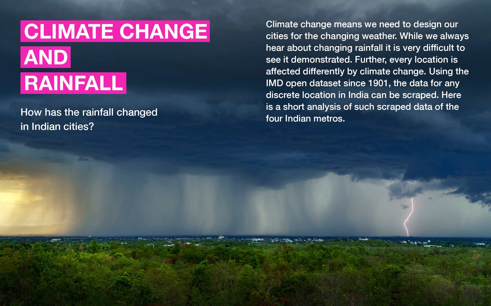
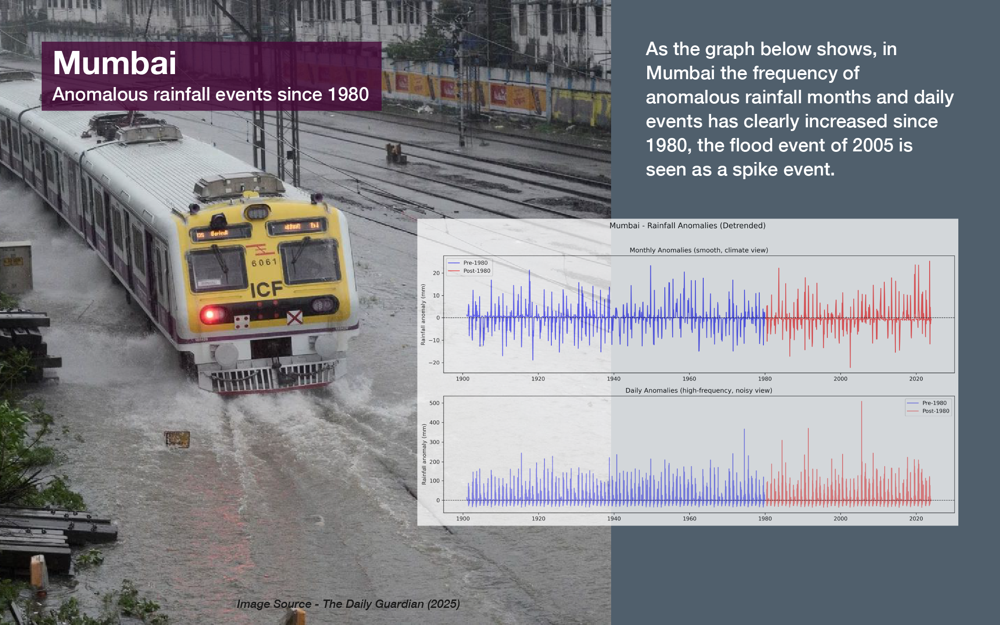
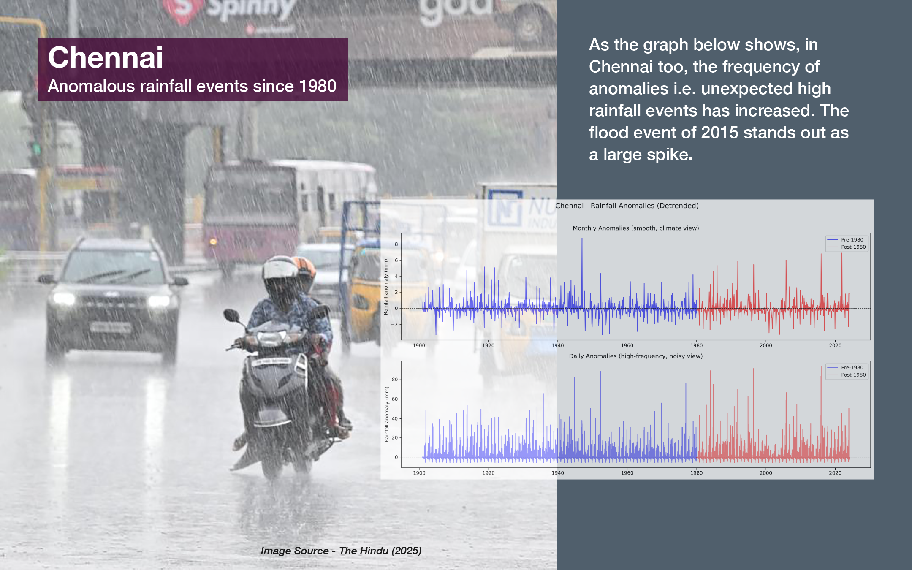
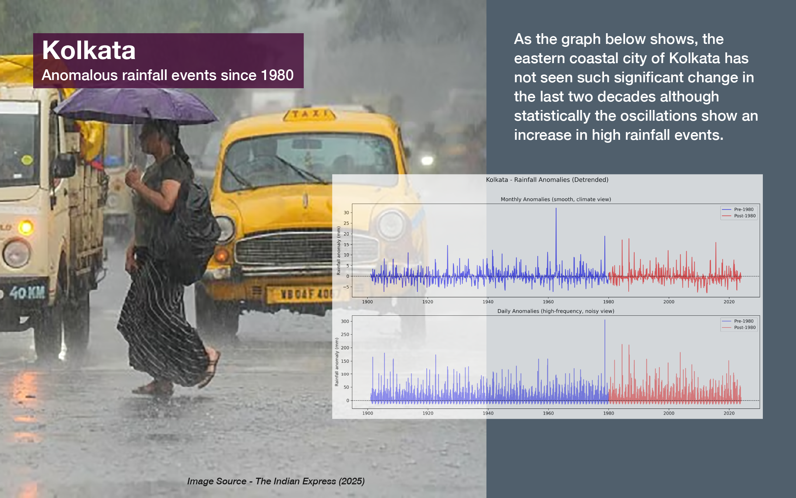
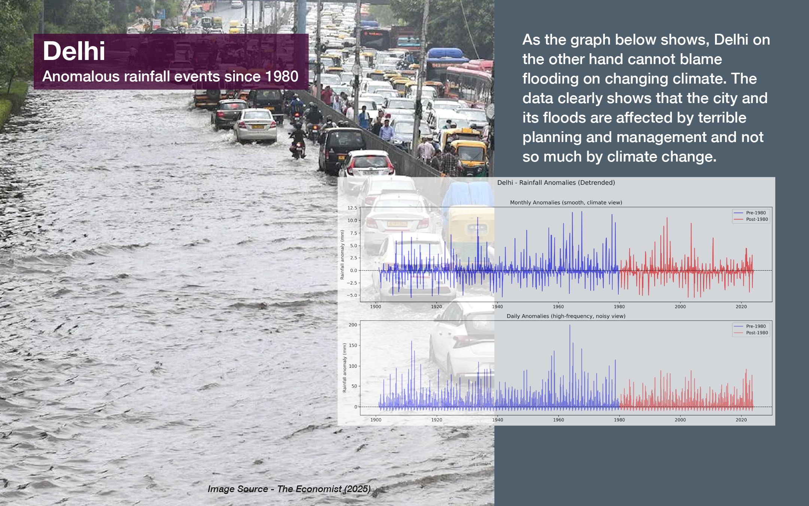
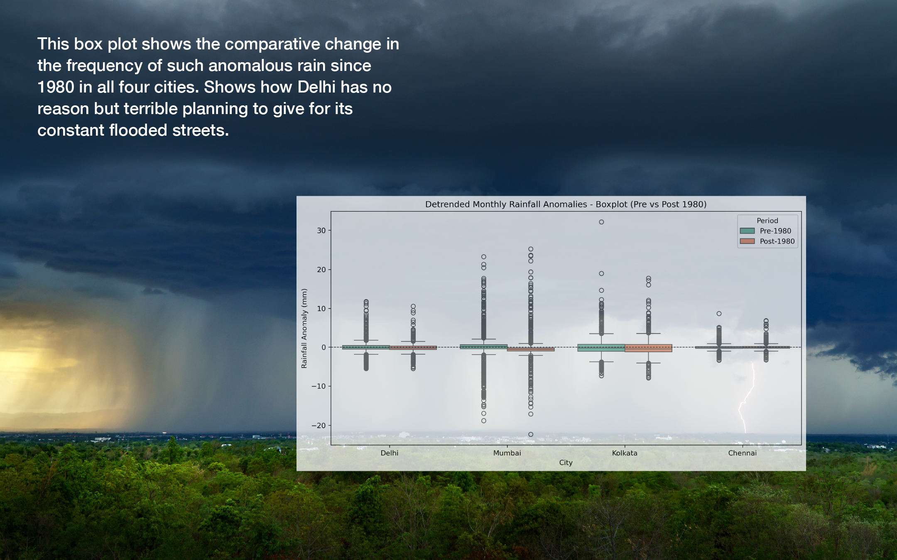

# Create timeseries of rainfall data since 1901 for any location in India

## Background
In the Climate Crisis every location is affected differently at different times of the year. In the Indian scenario the rainfall pattern has changed considerably in the last decades with some parts of the country become drier and other become wetter and a different occurence of rainfall events. As an Urbanist I am interested to find out how the rainfall has changed over the years in any particular city where I am planning future infrastructure works. This notebook does exactly that. It helps anyone who finds it intriguing to download rainfall grided data since 1901 upto 2023 for any particular location. And analyse it to see how the rainfall has changed.

## Methodology
The IMD Pune has published the gridded data of the grid 0.25 Degree Latitude and 0.25 Degree Longitude for India since 1901 at https://www.imdpune.gov.in/cmpg/Griddata/Rainfall_25_NetCDF.html' in separate files. But this data in NETCDF format is not a time series data since 1901 and is only compiled year wise. This data is very comprehensive and is available for open download. But the data is very heavy and calling the file for every year takes effort and time. Also the data of the entire country may not be necessary for any decision maker to take decisions about his own city or the city/location of his/her study. So the notebook automates and downloads, extracts, compiles and cleans the entire data since 1901 for any location or multiple locations into one data file for future use. By sequencing the download and extracting it serially and deleting the original file it frees up computing resources and can be adapted by any casual researcher with nominal resources. With this notebooks does is:

It opens the website Selects the year for which the entire indian data is to be downloaded Downloads data for a particular year, waits and checks for the completion of the download It arithmatically interpolates the data for the selected location from the available data(*read Approximation and Errors in next section). The example here specifies 4 main metros of India i.e. Delhi, Kolkata, Mumbai and Chennai. But you can replace the latitude and longitude for any location or loactions that you would be interested in. On completion of download of one year, it extracts the data for selected location and then deletes the original file downloaded file to save computing resources. It then auto selects the file for the next year and repeats the process till the entire time series is available in separate year wise files for only the particular selected location. At the end it combines all the files for the given years into one single time series data of rainfall since the last century. Thats that you have done it, you have the time series to analyse for any given location in India. For examples on how to perform analysis and understand the change in rainfall over the last century please visit my Github or Kaggle page.

## Caution
The download process consumes a fair amount of data, in average each location consumes about 6GB data. The code takes care that this space is not consumed on your hard disk by downloading each file, extracting, and deleting the origina file after storing of only relevant data. Yet please be aware of the large download volume and see that you are using a internet connection with large bandwidth and low or no costs :)
The sequencing of work also frees up computer resources like the processor, yet the processing of such large amount of data is time and resource heavy on your system given the large amount of data it is handling.

## Errors or approximations
The original grid data is available for the latitude longitude grid of 0.25x0.25 degrees. not for any particluar location. Once you have slevted your location of interest it interpolates the rainfall for thsi location from the lata of the four nearest vailable points. The margin for error may not ber very large as the maximum distance between a chosen location and available data point will be less than or equal to 12.5 kilometres. While this is the best method, it comes with some caveats. Eg. it does not consider large differences in topography if any found within the distance of 12.5 Km from the seleted location. But as this averages the data from 4 nearest points this error will be reduced.

## Implementation Notes
We need Selenium webdriver for your particular web browser. This may be different depending on your browser. Please modify the code for your browser and operating system of choice. For ease of implementation and for easy debugging I have separated the install and import of necessary libraries and combined the code in one section.
The following notebook uses the combination of Windows and Edge browser.
For Mac and Safari combination, Safari already comes installed with a Webdriver but needs to be enabled - Open Safari, go to Preferences > Advanced and check Show Develop menu in menu bar. In the Develop menu, check Allow Remote Automation. Of course please ping me if you encounter any problems.
As the internet speed varies, The code is built with a delay to check for files by sleeping very 3 minute intervals- again to save resources, but if you have a super fast connection and computer you could just delete the delay section.
Thank you, happy coding :)
